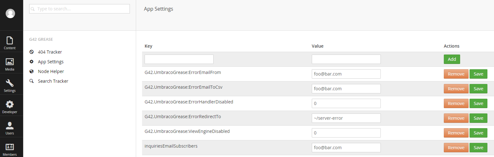

#AppSettings#

**This has now been internalized and removed from public usage. To keep this functionality, please use another project of mine: https://github.com/kgiszewski/G42.SecureSettings**

`AppSettings` is a way to have key/value pairs stored in a cache that can be edited in real-time.



These values can be used in C# like so:

```c#
using G42.UmbracoGrease.G42AppSettings.PetaPocoModels;

namespace MyNamespace
{
    public class MyApplication
    {
        public void MyMethod()
        {
            var setting = G42GreaseAppSetting.Get("MySetting");
            var allSettings = G42GreaseAppSetting.GetAll();

            G42GreaseAppSetting.Save("MySetting", "newValue");
            G42GreaseAppSetting.Remove("MySetting");
        }
    }
}
```

You can also get these key/values from AngularJs like so:
```js
angular.module('umbraco').controller('MyController', function ($scope, greaseAppSettingsService) {

    greaseAppSettingsService.getAll().then(function(data) {
       console.log(data);//value of the keys
    });

    greaseAppSettingsService.getAppSetting("MySetting").then(function(data) {
       console.log(data);//value of the key
    });

    greaseAppSettingsService.saveAppSetting("MySetting", "myValue").then(function() {

    });
});
```
