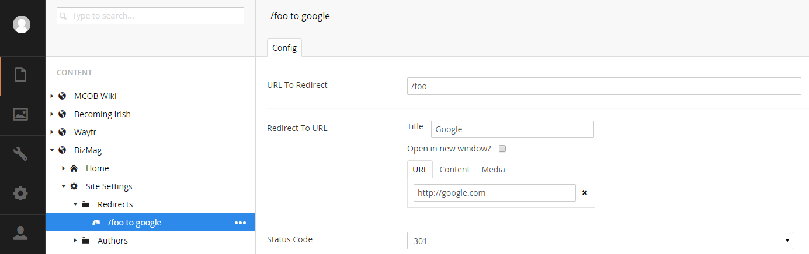

#RedirectHelper#

This helper handles custom redirections and forcing users to SSL when desired.

##Custom Redirects##
There are packages dedicated to mapping incoming paths to specific URL's. This functionality is similar but places the configuration of the redirects in the content tree. This is best explained with some visuals. Below you can see some folders and nodes that represent the redirects:



In the image, we can see that the tree has a `Redirects Folder` and ` Redirect` added as content. Each `Redirect` has a `UrlPicker`, a dropdown and a URL to listen for.

The document types have been configured to allow nested folders to better organize a bunch of redirects.

The `RedirectHelper` is then placed on the 404 template and checks the tree for any matches just before a 404 is issued like so:

```c#
@using G42.UmbracoGrease.G42RedirectHelper
@using G42.UmbracoGrease.Reports.PetaPocoModels

@inherits Umbraco.Web.Mvc.UmbracoTemplatePage
@{
    Layout = "Base.cshtml";
   
        //this takes the node that is the root of the redirects, the name of the redirect document type 
        //and an inline delegate that must return a Redirect model given the redirect IPublishedContent
        //inside the delegate you must map the document type inputs to the model
        RedirectHelper.TryRedirect(Umbraco.TypedContent(1234), "Redirect", (content) =>
        {
            var statusCodeValue = content.GetPropertyValue<string>("statusCode");
            
            var redirectStatusCode = 301;

            if (!String.IsNullOrWhiteSpace(statusCodeValue))
            {
                redirectStatusCode = Convert.ToInt32(statusCodeValue);
            }
            
            return new G42.UmbracoGrease.G42RedirectHelper.Models.Redirect()
            {              
                UrlToRedirect = content.GetPropertyValue<string>("urlToRedirect"),
                RedirectToUrl = content.GetPropertyValue<UrlPicker.Umbraco.Models.UrlPicker>("redirectToUrl").Url,
                StatusCode = redirectStatusCode
            };
        });
        
        //log the 404 because a redirect was not found
        G42Grease404Tracker.Add();
}

@* 404 template follows *@
<div>
</div>
```

##Other Methods##
You can force SSL on a particular page by calling `RedirectHelper.EnsureSSL()`.

##Future Plans##
Getting all of the nodes for redirection, mapping them and then searching them will get slow as the number of nodes increases. A caching mechanism will need to be used at some point. Caution on the use of many redirects.